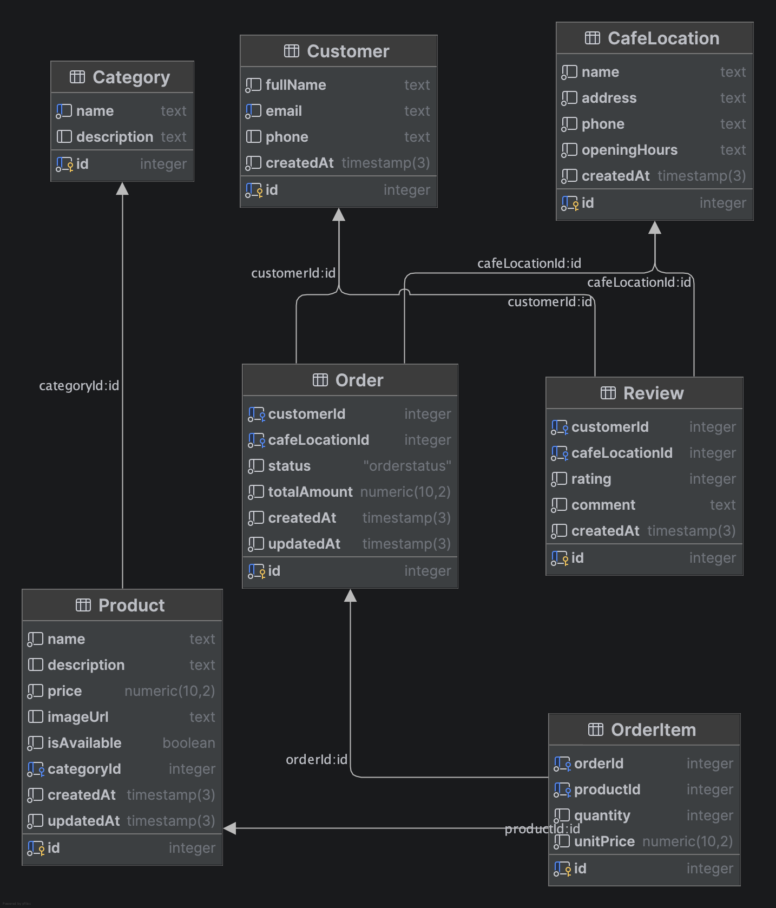

## Ссылка
https://m3313-galakhova-backend.onrender.com

### ER-диаграмма

## API
Документация OpenAPI (Swagger UI) — `/api/docs`, JSON-спецификация — `/api/docs-json`.

### Ресурсы
- `/api/users` — пользователи, вложенные `/{id}/reviews` и `/{id}/sessions`
- `/api/reviews` — отзывы
- `/api/categories` — разделы меню, вложенные `/{id}/products`
- `/api/products` — позиции меню
- `/api/locations` — кофейни сети

Коллекции возвращаются постранично (параметры `page` и `limit`), ссылки на первую,
предыдущую, следующую и последнюю страницы передаются в заголовке ответа `Link`.
